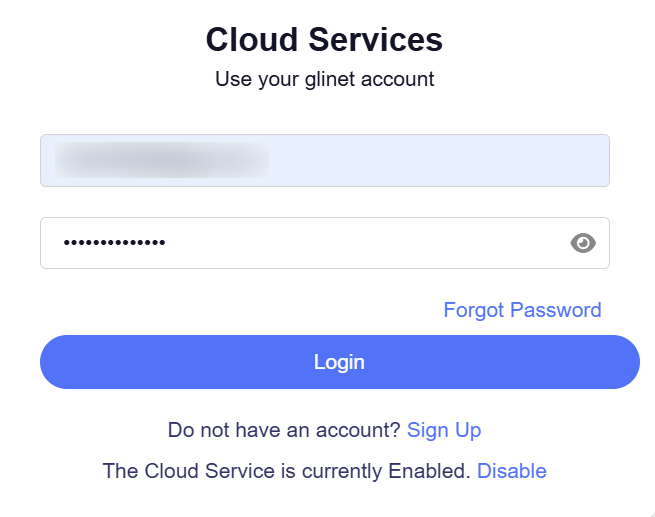
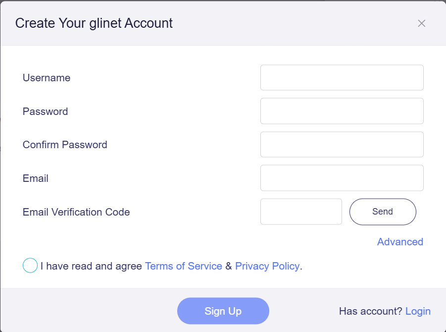
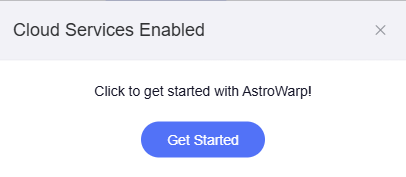
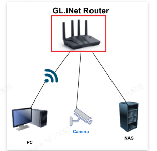
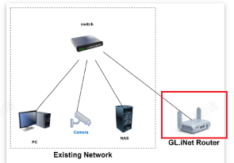
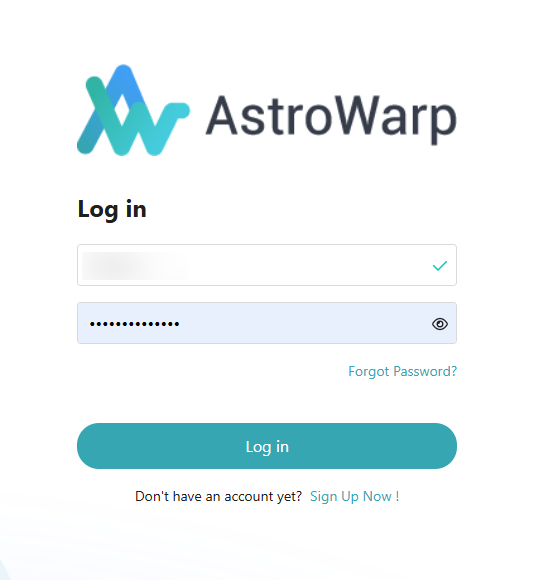
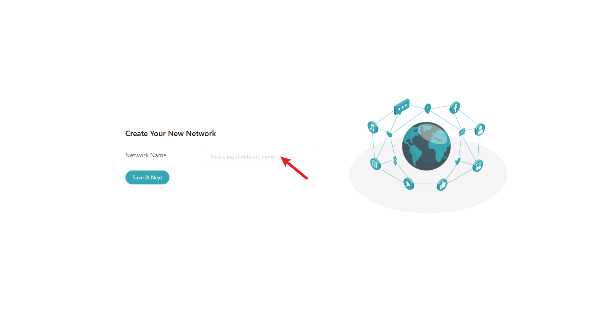
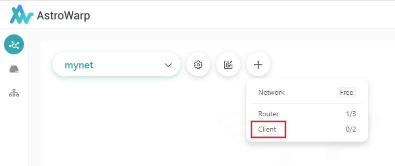
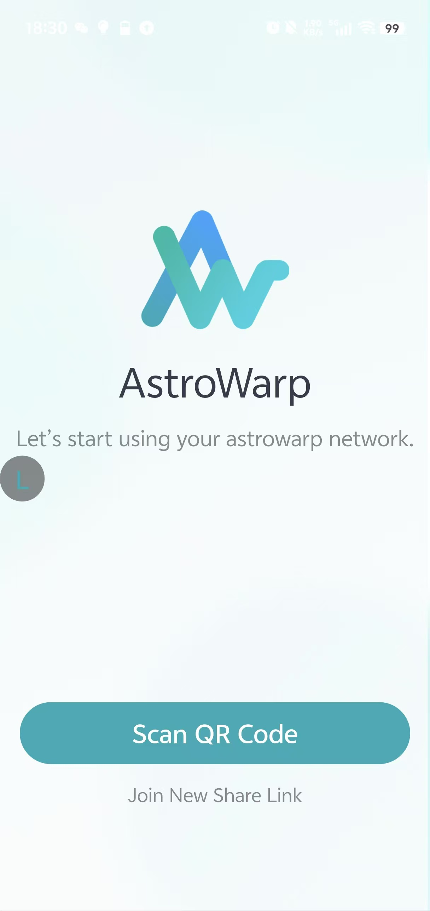

# Quick start

## **Preparation**
#### **Check model and version**
Router Compatibility: Confirm that your router model falls under the following list:

<table>
<thead>
  <tr style="background-color:#f6f6f6">
    <th>Supported Models</th>
    <th>Version</th>
    <th>Firmware Download</th>
  </tr>
</thead>
<tbody>
  <tr>
    <td>Spitz AX (GL-X3000)</td>
    <td>4.7.0 or higher</td>
    <td><a href="https://dl.gl-inet.com/router/x3000/?type=beta" target="_blank">Beta Firmware</a></td>
  </tr>
    <tr>
    <td>Puli AX (GL-XE3000)</td>
    <td>4.7.0 or higher</td>
    <td><a href="https://dl.gl-inet.com/router/xe3000/?type=beta" target="_blank">Beta Firmware</a></td>
  </tr>
    <tr>
    <td>Beryl AX (GL-MT3000)</td>
    <td>4.7.0 or higher</td>
    <td><a href="https://dl.gl-inet.com/router/mt3000/stable" target="_blank">Beta Firmware</a></td>
  </tr>
    <tr>
    <td>Flint 2 (GL-MT6000)</td>
    <td>4.7.0 or higher</td>
    <td><a href="https://dl.gl-inet.com/router/mt6000/stable" target="_blank">Beta Firmware</a></td>
  </tr>
    <tr>
    <td>Brume 2 (GL-MT2500/GL-MT2500A)</td>
    <td>4.7.0 or higher</td>
    <td><a href="https://dl.gl-inet.com/router/mt2500/stable" target="_blank">Beta Firmware</a></td>
  </tr>
    <tr>
    <td>Flint (GL-AX1800)</td>
    <td>4.7.0 or higher</td>
    <td><a href="https://dl.gl-inet.com/router/ax1800/beta" target="_blank">Beta Firmware</a></td>
  </tr>
    <tr>
    <td>Slate AX (GL-AXT1800)</td>
    <td>4.7.0 or higher</td>
    <td><a href="https://dl.gl-inet.com/router/axt1800/beta" target="_blank">Beta Firmware</a></td>
  </tr>
    <tr>
    <td>Slate 7(GL-BE3600)</td>
    <td>coming soon</td>
    <td></td>
  </tr>
</tbody>
</table>


#### **Router Connection and Initial Setup**
If you are a new user, please complete the GL router connection and initial setup following the [tutorial](https://docs.gl-inet.com/router/en/4/faq/first_time_setup/){target="_blank"} below before starting the configuration.


#### **Enable Cloud Services**
Please follow the steps below to enable Cloud Services before using AstroWarp:<br>

**Step 1:**Access the router's management interface (http://192.168.8.1). In the left panel, navigate to CLOUD SERVICES → AstroWap. Click on "Get Started." A "Cloud Services" window will appear in the top-right corner. Click the "Enable" button to activate Cloud Services.


**Step 2**: Log in to your GL account.
<br>
If you don’t have an account yet, you’ll need to create one by clicking the "Sign up" button and completing the login process.

<br>

**Step 3**: Click the "Get Started" button to open AstroWarp.




Note: Every router in the network must be signed in to the GL.iNet account.


### **Connect device to the router**
If you are configuring for the first time, we recommend that you connect the device to the LAN port or WIFI of the router, which is applicable to all scenarios.



In many cases, our device is already in the existing network. At this time, we just need to add the router to the existing network. (Notice: Only applies to the case where the device is only used as the accessed end or the router is used as the exit node)



### **Log in to your account**

Use your GL.iNet account to log in to AstroWarp.




## **Router node management**

### Add router nodes

You can add more router nodes to the basic network to enrich your application.


<video controls>
  <source src="../images/quick_start/video/Add-router-nodes.mp4" type="video/mp4">
</video>

### Node renaming

To make the network clearer, we can set our favorite names for the nodes.


### Delete router nodes

If the router node is no longer needed, we can delete it.

<video controls>
  <source src="../images/quick_start/video/Delete-router-nodes.mp4" type="video/mp4">
</video>

### Disable astrowarp services

If you need to disable the astrowarp service on your router, you can turn off the virtual network connection in your router's details settings.

<video controls>
  <source src="../images/quick_start/video/Disable-astrowarp-services.mp4" type="video/mp4">
</video>

## **Access permission settings**

Node access and resource access constitute the permission control mechanism of astrowarp, and the device is only allowed to access if both permissions are set correctly.



### Node access permissions

#### Add permissions

Draw a line on the topology map to establish a network connection between two nodes.


By clicking on the connection, we can set the access permissions between nodes through the permission switch on the right.


**Notice:** when you try to connect a router to a cloud node, it means that the current router uses the cloud node as the aggregate VPN exit. Currently, only EXCLUSIVE server support the aggregate VPN function.

#### Remove permissions

You can also select and delete connections that are no longer needed.

<video controls>
  <source src="../images/quick_start/video/Remove-permissions.mp4" type="video/mp4">
</video>


### Resource access permissions

You can add or delete resources through the details interface of the node.


Or you can quickly add resources through the + sign on the right of the node.

<video controls>
  <source src="../images/quick_start/video/sign-on-the-right-of-the-node.mp4" type="video/mp4">
</video>

Note: You can view the IP address and MAC address in the router's management interface to verify the resources.


#### Accessible address (Virtual IP)

Once a resource is added, a virtual IP will be automatically assigned for access, virtual IP can effectively avoid subnet conflicts and IP changes between routers.

The virtual IP is not actually assigned to your device, but is done through NAT rules like the one below.

```
iptables -t nat -I POSTROUTING -d 10.0.2.3/32 -j DNAT --to-destination 192.168.99.171
```

The upper limit of virtual IP allocation is 254. If this number is exceeded, you need to delete some unused or infrequently used resources.

#### Domain Name

You can set a domain name for **local** access for any resource. The domain name suffix is always atwp.net. The fixed suffix is for easier certificate issuance.


This domain name is resolved locally by the router, so please do not set DNS encryption on your access end or point the DNS service to other addresses.

## **Exit Node Settings**

Router nodes can be used as Internet exits.


Exit nodes are not used for any router nodes by default, so we need to set whether other routers use this exit.


## **Cloud Node Management**

### Switch Cloud Node Location

In a few cases, the recommended server may be subject to some restrictions. If necessary, you can switch to a different server location.


## **Network Management**

### Stop or start network

<video controls>
  <source src="../images/quick_start/video/Delete-network.mp4" type="video/mp4">
</video>

## **Use the AstroWarp Client**

### **Preparation**

Before start, You should create your network as described in the [Quick Start](../quick_start/index.md) and download the appropriate client application [here](https://www.astrowarp.net/download).

## **Add share link in network**

**Step 1:** Add share link in Astrowarp network



**Step 2:** Set up share link

{class="glboxshadow"}

{class="glboxshadow"}


**Link Lifetime:**  The validity period of the shared link

**Add Once:**  Whether to allow the shared link to be used by multiple clients

**Use Internet Exit:**  Whether to allow the client to use the Internet exit

**Accessible Router: ** List of routers to be accessed


## **Join network in client**

Join the Astrowarp network using the shared link in the client

* windows

{class="glboxshadow"}


* Mobile phone




## **FAQ** 

**Q:** How can I quickly apply the modified configuration on the client?

**A:** Exit and reopen the client to automatically re-pull the latest configuration


___

Still have questions? Visit our [Community Forum](https://forum.gl-inet.com){target="_blank"}.

