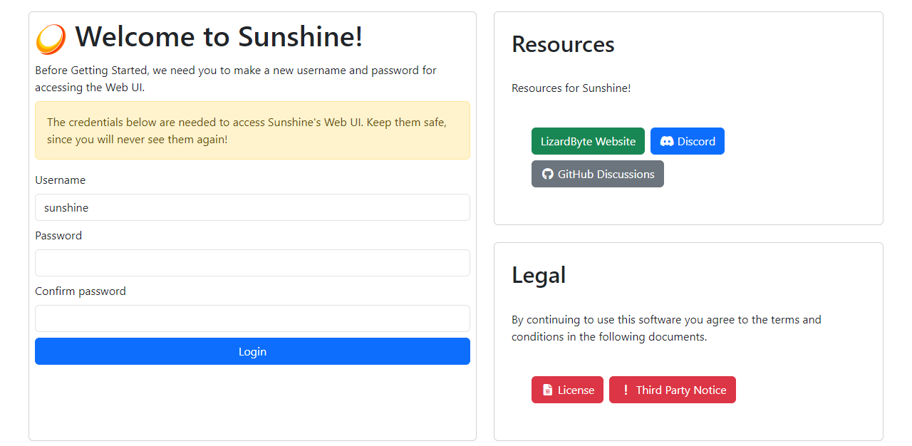

# Setting Up AstroWarp with GL.iNet Routers: Game Streaming
Game streaming allows you to play high-performance games on any device remotely, whether on a weaker PC, laptop, or mobile device. This guide will help you set up remote desktop streaming for games using Windows Remote Desktop.

## **Creating the Network**

**Step1:** Select a plan to create the network (available with all plans).

**Step2:** Set a Network Name: Choose a preferred name for your network, such as  Game_Streaming.

**Step3:** Integrate the router hosting your gaming server into the network. The Free Plan allows you to do this at no additional cost.

**Step4:** Once the network is created, make your gaming host accessible as a resource and add it to the current AstroWarp network.

**Step5:** Add the devices you'll use to play remotely, such as phones, tablets, or other devices, to the network as clients.

## **Install and Configure a Game Streaming Client**

While Windows Remote Desktop is effective for work-related tasks, using a dedicated game streaming app can offer significantly better performance for gaming. Two recommended options are **Sunshine** and **GeForce Experience**.

### **Host Gaming PC Requirements**

#### **For Sunshine:**
* **GPU:** Any modern GPU from AMD, NVIDIA, or Intel.  
* **Operating System:**
    * Windows 10 or 11 (**Windows 7 and 8 are not supported**).
    * macOS 12 and newer (**experimental**).
    * Linux: Debian 11, Ubuntu 22.04, Fedora 38, or newer.

#### **For GeForce Experience:**
* **Operating System:** Windows 10 or 11 (**Windows 7 and 8 may be supported**).
* **GPU:** NVIDIA GeForce GTX/RTX 600+ series GPU or NVIDIA Quadro GPU (Kepler series or later).
* **Software:** NVIDIA GeForce Experience (GFE) 2.1.1 or higher, or NVIDIA Quadro Experience.
* **Display:** A 720p or higher display (or headless display dongle) connected to the NVIDIA GPU.
* **Network Speed:** 5 Mbps or higher upload speed (only required for streaming outside your house).

## **Sunshine Installation and Configuration Guide**

<!-- ### **Using Sunshine** -->

Detailed instructions for installing and configuring Sunshine can be found in this document: [Sunshine Documentation](https://github.com/moonlight-stream/moonlight-docs/wiki/Setup-Guide){target="_blank"}.

1. Download and Install Sunshine:
	1. Go to the [Setup Page](https://docs.lizardbyte.dev/projects/sunshine/latest/about/setup.html){target="_blank"} to download the latest version.
	2. Install it on your gaming PC. You may need to reboot your PC after installation to complete the setup and enable controller emulation.
2. Open the Configuration Page:
	1. Launch Sunshine. A configuration page will open in your web browser, and you may see a "this page is not secure" warning, which can be ignored.
	2. If needed, you can manually access it via the tray menu option "Open Sunshine" or by visiting [https://localhost:47990](https://localhost:47990/){target="_blank"}.
3. Create an Account:
	1. Upon first launching Sunshine, you’ll be prompted to create an account. This is essential for securing access since others can connect to your PC if they access this interface.
   
	

4. Connect with Moonlight:
	1. Open Moonlight on your client device and ensure it is connected to the same network as your gaming PC.
	2. Your gaming PC should automatically appear in the PC list. If it doesn’t, you can manually add it using its IP address.
5. Pair the Devices:
	1. Select your gaming PC from the list to start pairing. Sunshine will send a notification to your host PC.
	2. Follow the prompt to enter the PIN displayed in Moonlight on the pairing dialog and submit it.
6. Test Streaming:
    1. Try streaming a game or application from your gaming PC to verify that everything is working properly.
	
7. Access Pre-loaded Applications:
    1. Sunshine has Steam and Remote Desktop pre-loaded for easy access.
8. Further Assistance:
    1. For more information or troubleshooting, refer to the Sunshine support documentation at [this link](https://docs.lizardbyte.dev/projects/sunshine/latest/about/overview.html){target="_blank"}.

### **Using GeForce Experience**
1. Install GeForce Experience:
    1. Download and install the GeForce Experience software from NVIDIA on your gaming PC. After installation, you may need to reboot your PC to complete the setup.
2. Enable GameStream:
    1. Open GeForce/Quadro Experience and click on the Settings (gear) icon. Navigate to the SHIELDsection and ensure the GameStream toggle is switched on (green). If the SHIELD tab is missing, refer to the [troubleshooting guide](https://github.com/moonlight-stream/moonlight-docs/wiki/Troubleshooting){target="_blank"}.
 
3.  Launch Moonlight:
    1. Start the Moonlight app on your client device and ensure it is connected to the same network as your gaming PC. In most cases, your PC will appear automatically in the PC list after a few seconds. Click on your PC's entry to initiate pairing. 
4.  Pair Devices:
    1. On your PC, enter the PIN displayed in Moonlight and confirm the pairing request.
5.  Test Streaming:
    1. Stream a game or application to verify that everything is functioning correctly.
6. Manually Add Games (if necessary):
    1. If a game doesn’t appear in Moonlight, you can manually add it in GeForce Experience. Alternatively, you can stream your desktop and launch any program directly.

<!-- 1. On your gaming PC, download and install the latest version of Sunshine from the [setup page](https://docs.lizardbyte.dev/projects/sunshine/latest/about/setup.html){target="_blank"}. Your PC may require a reboot after installation to complete the setup and enable controller emulation.
1. Start Sunshine and wait for the configuration page to open in your web browser. The browser may display a "this page is not secure" warning, which you can safely ignore. You can also manually access this interface using the "Open Sunshine" option in the tray menu or by visiting https://localhost:47990/ directly in your browser.
2. When Sunshine launches for the first time, it will prompt you to create an account to secure access to the configuration interface. This step is crucial, as anyone with access to this interface can add new clients to remotely access your computer.

1. Start Moonlight and ensure your client device is connected to the same network as your PC. In most cases, your gaming PC will automatically appear in the PC list within a few seconds. If it doesn’t appear or if you’re pairing over the Internet, you can manually add the PC by entering its IP address.
2. Select the entry in the PC list to initiate pairing. Sunshine will send a pairing notification to your host PC, redirecting you to the PIN page. Enter the PIN displayed in Moonlight and submit the pairing dialog. If you encounter an error after submitting the PIN, refer to the troubleshooting steps for assistance. -->
<!-- ### **Using GeForce Experience**
1. On your gaming PC, download and install the **GeForce Experience** software from NVIDIA. Your PC may require a reboot to complete the installation.
   
    ○ If your PC uses a Quadro GPU, install the **Quadro Experience** software instead.

2. If you encounter a GPU driver bug that affects NVIDIA GameStream hosts on Windows 11, you’ll need to disable **Hardware-accelerated GPU Scheduling** on your host PC. To do this:
    1.  Open "Graphics Settings" from the Start Menu.
    2.  Click "Change default graphics settings".
    3.  Set the **Hardware-accelerated GPU scheduling** option to **Off**.

1. Launch **GeForce Experience** (or **Quadro Experience** for Quadro GPUs) and click the **Settings** gear icon. Navigate to the **SHIELD** tab and ensure the **GameStream** toggle is switched to the **"on"** position (green). If the SHIELD tab is missing, refer to the   troubleshooting steps for assistance.

1. Start **Moonlight** and ensure your client device is connected to the same network as your PC. In most cases, your gaming PC will appear in the PC list within a few seconds. Select the PC entry to begin pairing.
2. On your PC, enter the PIN displayed in Moonlight and confirm the pairing dialog. If the pairing dialog doesn’t appear, refer to the [troubleshooting steps](https://chatgpt.com/c/677df804-0db8-800d-b3df-e7d621d3b170#){target="_blank"}.
3. Test streaming a game or application to verify that everything is working correctly. If you experience any issues, consult the troubleshooting steps.
4. If the game you want to stream isn’t listed in Moonlight, you can manually add it. Alternatively, you can stream your desktop and launch any application you wish.

## **Connect and Start Streaming**

* **Open Remote Desktop on the Remote Device:**
    1. On another device (Windows, macOS, or mobile), open the **Remote Desktop Connection** app. 
    2. Enter the **Virtual IP address** provided by AstroWarp. 
    3.  Enter your credentials (username and password). 
   

* **Adjust Streaming Quality:**
  
	To ensure smooth gameplay, reduce the streaming quality if the connection is unstable. Most streaming apps (e.g., Steam, Moonlight) allow you to adjust the resolution and frame rates.

## **FAQ**
**Q**: Firewall settings error message. 
**A**: Configure Windows Firewall:

1. Sunshine and GeForce Experience should automatically create firewall rules. If they don’t work, manually create the rules: 
    ○ Open Command Prompt or PowerShell as an administrator. 
    ○ Run the following commands: 

		netsh advfirewall firewall add rule name="GameStream UDP" dir=in protocol=udp localport=5353,47998-48010 action=allow 
		netsh advfirewall firewall add rule name="GameStream TCP" dir=in protocol=tcp localport=47984,47989,48010 action=allow

   
   
   
2. Ensure your PC appears as "online" in Moonlight after applying the rules. -->
