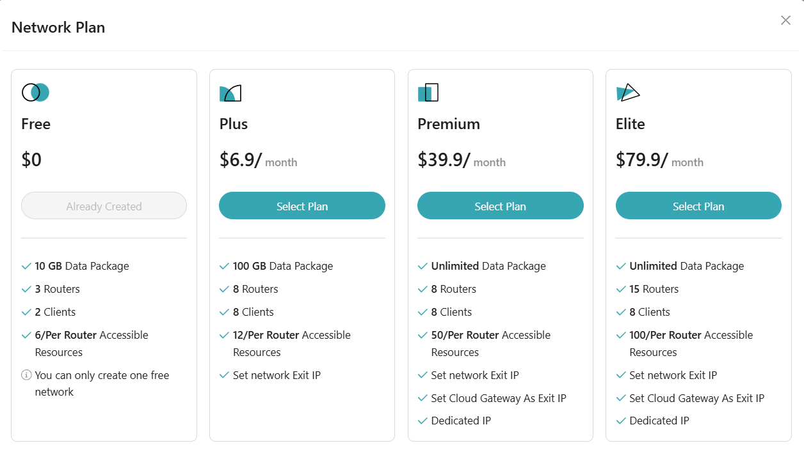
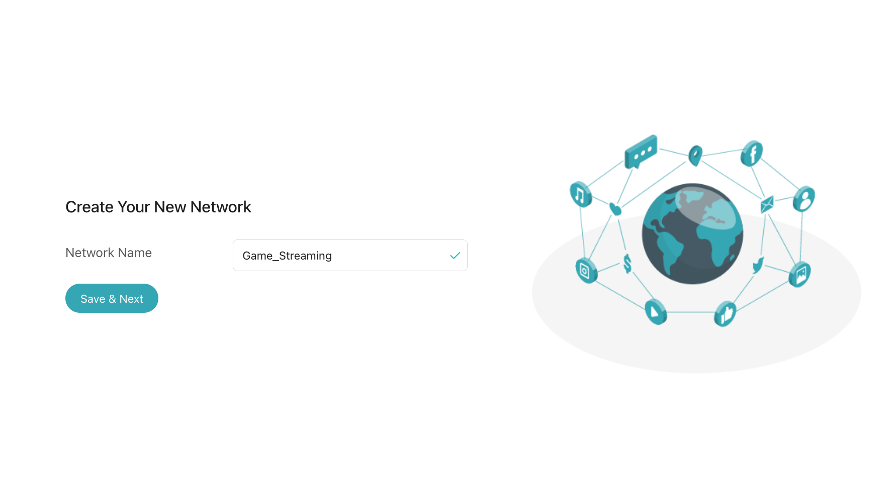
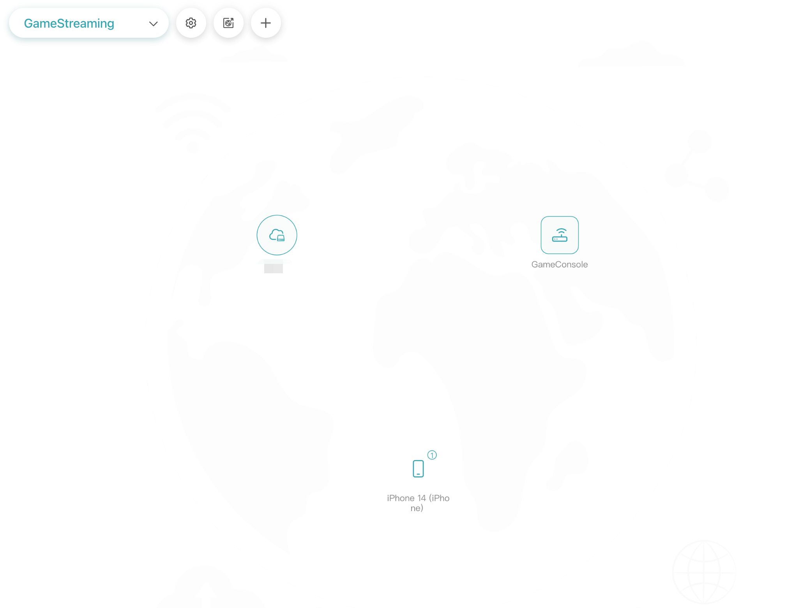
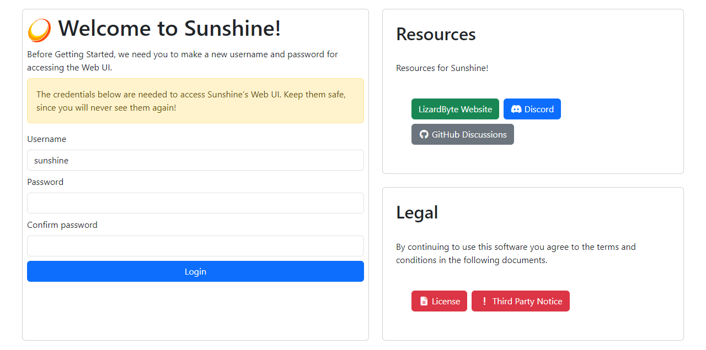
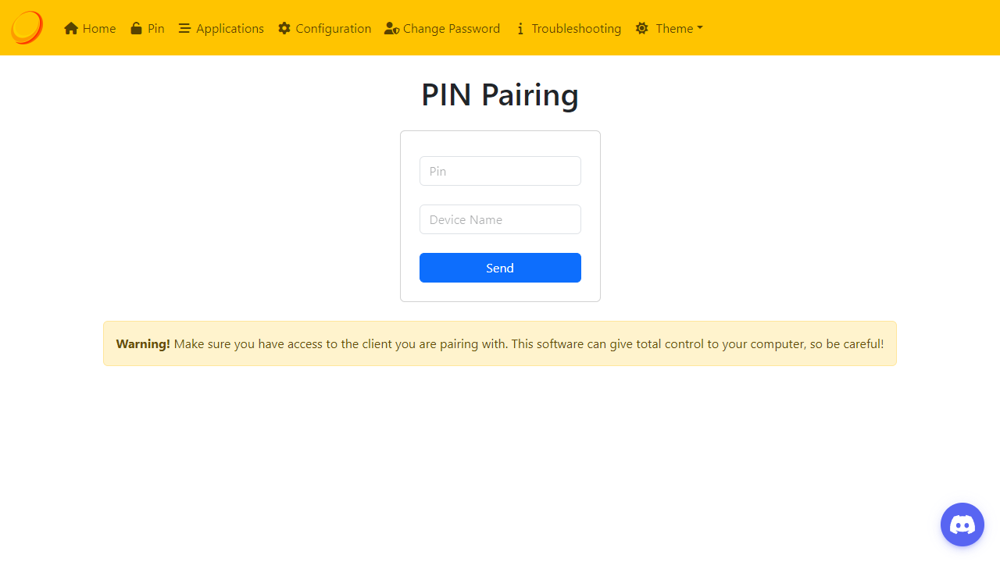

# Setting Up AstroWarp with GL.iNet Routers: Game Streaming
Game streaming allows you to play high-performance games on any device remotely, whether on a weaker PC, laptop, or mobile device. This guide will help you set up remote desktop streaming for games using Windows Remote Desktop.

## **Creating the Network**

**Step1:** Select a plan to create the network (available with all plans).

**Step2:** Set a Network Name: Choose a preferred name for your network, such as Game_Streaming.

**Step3:** Integrate the router hosting your gaming server into the network. The Free Plan allows you to do this at no additional cost.

**Step4:** Once the network is created, make your gaming host accessible as a resource and add it to the current AstroWarp network.

**Step5:** Add the devices you’ll use to play remotely, such as phones, tablets, or other devices, to the network as clients.

## **Install and Configure a Game Streaming Client**

Although Windows Remote Desktop works for general tasks, a dedicated game streaming app may offer better performance. Two great options are **Sunshine** and **GeForce Experience**.

### **Host Gaming PC Requirements**

#### **For Sunshine:**
* Any modern GPU from AMD, NVIDIA, or Intel. 
* Windows 10 or 11 (Windows 7 and 8 are not supported).
* macOS 12 and newer (experimental).
* Linux (Debian 11, Ubuntu 22.04, Fedora 38, or newer).

#### **For GeForce Experience:**
* Windows 10 or 11 (Windows 7 and 8 may be supported).
* NVIDIA GeForce GTX/RTX 600+ series GPU or NVIDIA Quadro GPU (Kepler series or later).
* NVIDIA GeForce Experience (GFE) 2.1.1 or higher, or NVIDIA Quadro Experience.
* 720p or higher display (or headless display dongle) connected to the NVIDIA GPU.
* 5 Mbps or higher upload speed (only required for streaming outside your house).

## **Setup Guides**

### **Using Sunshine**

Detailed instructions for installing and configuring Sunshine can be found in this document: [Sunshine Documentation](https://docs.lizardbyte.dev/projects/sunshine/en/latest/){target="_blank"}.

1. On your gaming PC, download and install the latest version of Sunshine from the [setup page](https://docs.lizardbyte.dev/projects/sunshine/en/latest/about/setup.html){target="_blank"}. Your PC may require a reboot after installation to complete the setup and enable controller emulation.
2. Start Sunshine and wait for the configuration page to open in your web browser. The browser may display a "this page is not secure" warning, which you can safely ignore. You can also manually access this interface using the "Open Sunshine" option in the tray menu or by visiting https://localhost:47990/ directly in your browser.
3. When Sunshine launches for the first time, it will prompt you to create an account to secure access to the configuration interface. This step is crucial, as anyone with access to this interface can add new clients to remotely access your computer.

4. Start Moonlight and ensure your client device is connected to the same network as your PC. In most cases, your gaming PC will automatically appear in the PC list within a few seconds. If it doesn’t appear or if you’re pairing over the Internet, you can manually add the PC by entering its IP address.
5. Select the entry in the PC list to initiate pairing. Sunshine will send a pairing notification to your host PC, redirecting you to the PIN page. Enter the PIN displayed in Moonlight and submit the pairing dialog. If you encounter an error after submitting the PIN, refer to the troubleshooting steps for assistance.

    1. Try streaming a game or app to ensure everything is functioning correctly. If you encounter any issues, refer to the [troubleshooting steps](https://chatgpt.com/c/677df804-0db8-800d-b3df-e7d621d3b170#){target="_blank"} for assistance.
    2. Sunshine includes pre-configured support for Steam and Remote Desktop. You can manually add additional games and applications by following [Sunshine's guide to adding apps](https://chatgpt.com/c/677df804-0db8-800d-b3df-e7d621d3b170#){target="_blank"}.

### **Using GeForce Experience**
1. On your gaming PC, download and install the **GeForce Experience** software from NVIDIA. Your PC may require a reboot to complete the installation.\
   
    ○ If your PC uses a Quadro GPU, install the **Quadro Experience** software instead.

2. If you encounter a GPU driver bug that affects NVIDIA GameStream hosts on Windows 11, you’ll need to disable **Hardware-accelerated GPU Scheduling** on your host PC. To do this:
    1.  Open "Graphics Settings" from the Start Menu.
    2.  Click "Change default graphics settings."
    3.  Set the **Hardware-accelerated GPU scheduling** option to **Off**.

1. Launch **GeForce Experience** (or **Quadro Experience** for Quadro GPUs) and click the **Settings** gear icon. Navigate to the **SHIELD** tab and ensure the **GameStream** toggle is switched to the **"on"** position (green). If the SHIELD tab is missing, refer to the troubleshooting steps for assistance.

1. Start **Moonlight** and ensure your client device is connected to the same network as your PC. In most cases, your gaming PC will appear in the PC list within a few seconds. Select the PC entry to begin pairing.
2. On your PC, enter the PIN displayed in Moonlight and confirm the pairing dialog. If the pairing dialog doesn’t appear, refer to the [troubleshooting steps](https://chatgpt.com/c/677df804-0db8-800d-b3df-e7d621d3b170#){target="_blank"}.
3. Test streaming a game or application to verify that everything is working correctly. If you experience any issues, consult the troubleshooting steps.
4. If the game you want to stream isn’t listed in Moonlight, you can manually add it. Alternatively, you can stream your desktop and launch any application you wish.

## **Connect and Start Streaming**

* **Open Remote Desktop on the Remote Device:**
    1. On another device (Windows, macOS, or mobile), open the **Remote Desktop Connection** app. 
    2. Enter the **Virtual IP address** provided by AstroWarp. 
    3.  Enter your credentials (username and password). 
   

* **Adjust Streaming Quality:**
  
	To ensure smooth gameplay, reduce the streaming quality if the connection is unstable. Most streaming apps (e.g., Steam, Moonlight) allow you to adjust the resolution and frame rates.

## **FAQ**
**Q**: Firewall settings error message. 
**A**: Configure Windows Firewall:

1. Sunshine and GeForce Experience should automatically create firewall rules. If they don’t work, manually create the rules: 
    ○ Open Command Prompt or PowerShell as an administrator. 
    ○ Run the following commands: 

		netsh advfirewall firewall add rule name="GameStream UDP" dir=in protocol=udp localport=5353,47998-48010 action=allow 
		netsh advfirewall firewall add rule name="GameStream TCP" dir=in protocol=tcp localport=47984,47989,48010 action=allow

   
   
   
2. Ensure your PC appears as "online" in Moonlight after applying the rules.
