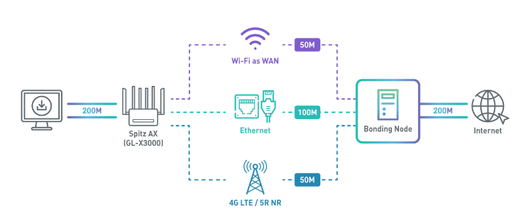
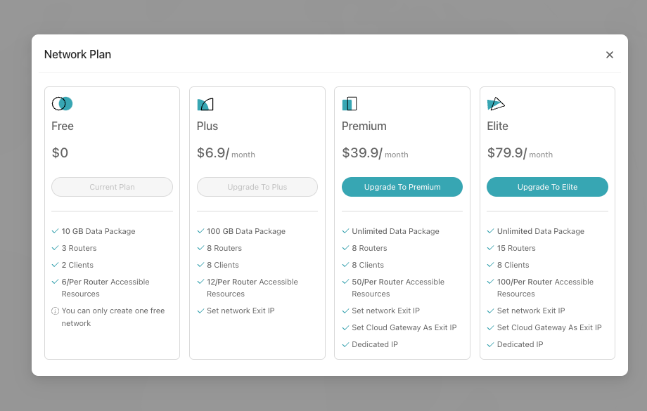
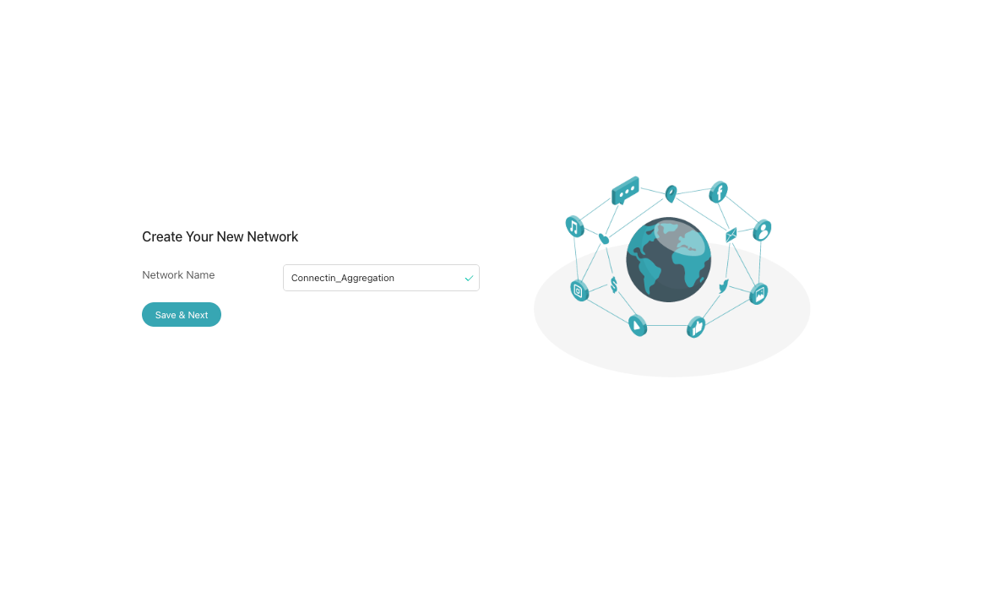
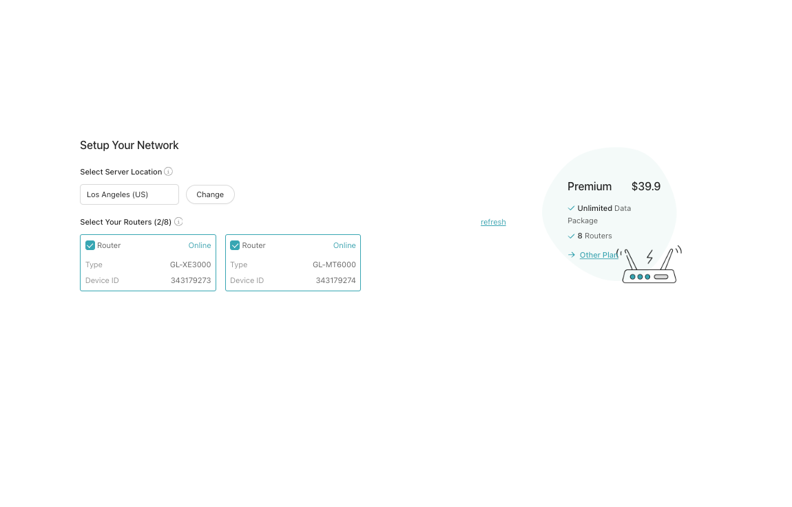

<!-- # Setting Up AstroWarp with GL.iNet Routers: Aggregation VPN -->

This document will guide you in creating an Aggregated VPN link for internet access. By using an Aggregated VPN, users can enjoy a better online experience in certain scenarios.

## **Creating the Network**

**Step 1:** Choose a network plan that suits your needs. Please note that the connection aggregation service is available exclusively with the Premium and Elite plans."

**Step 2:** Set a Network Name: Choose a preferred name for your network, such as "Connection_Aggregation.".

**Step 3:** Select the router device you intend to use for connection aggregation and add it to the network.

**Step 4:** After creating the network, manually drag the connection point from the router to the cloud gateway within the interface. Once this step is completed, the aggregation connection will be successfully established, allowing your router device to access the internet using the aggregated connection.

<video controls>
  <source src="../../images/tutorials/connection_aggregation/video.mov" type="video/mp4">
</video>

You can check if our public IP address matches the public IP address of the aggregation node via [ipaddress.my](https://www.ipaddress.my/){target="_blank"}.

**Step 5:**Once confirmed the IP address, you can test different application scenarios. For example, you can try disconnecting the router's tethering network connection during a video conference to observe if the call is interrupted due to network issues.

