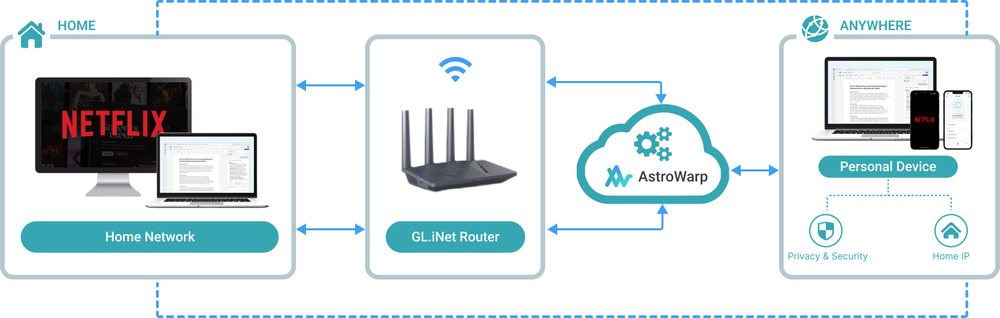
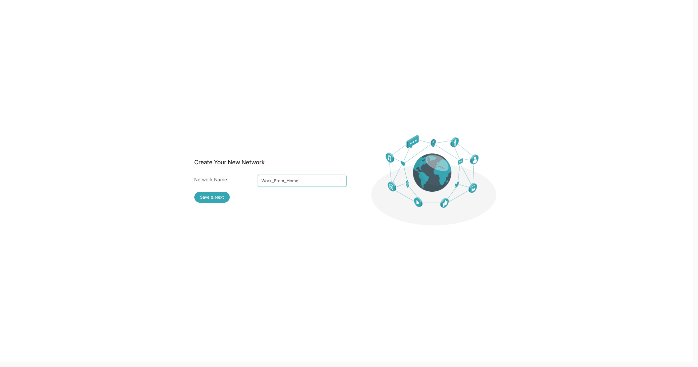
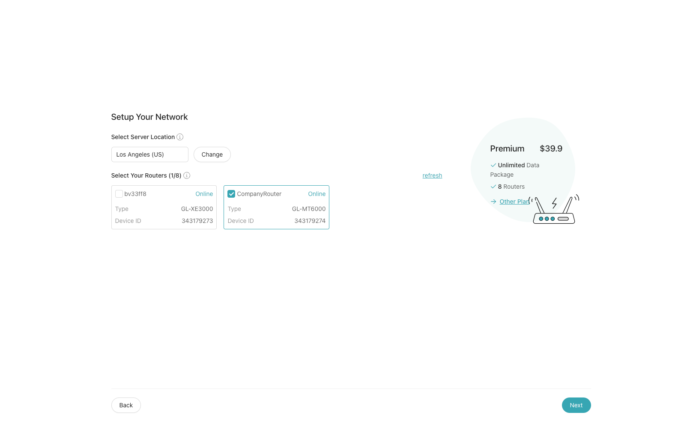
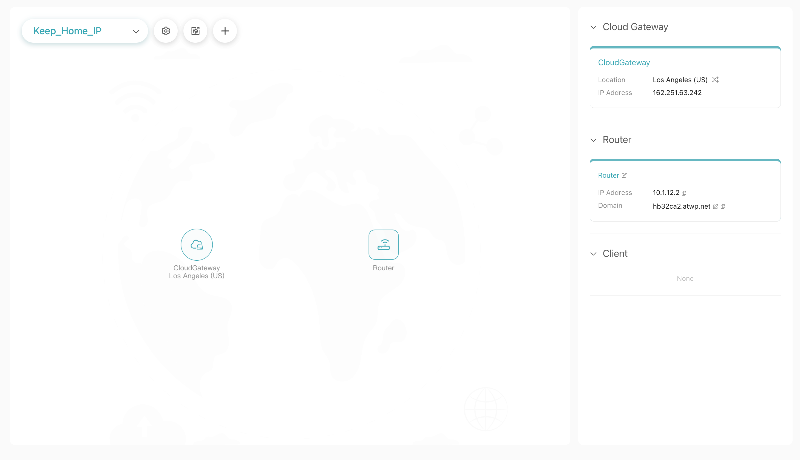
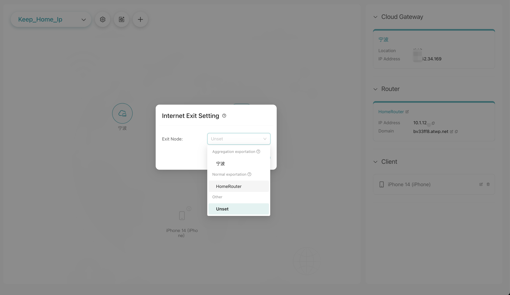
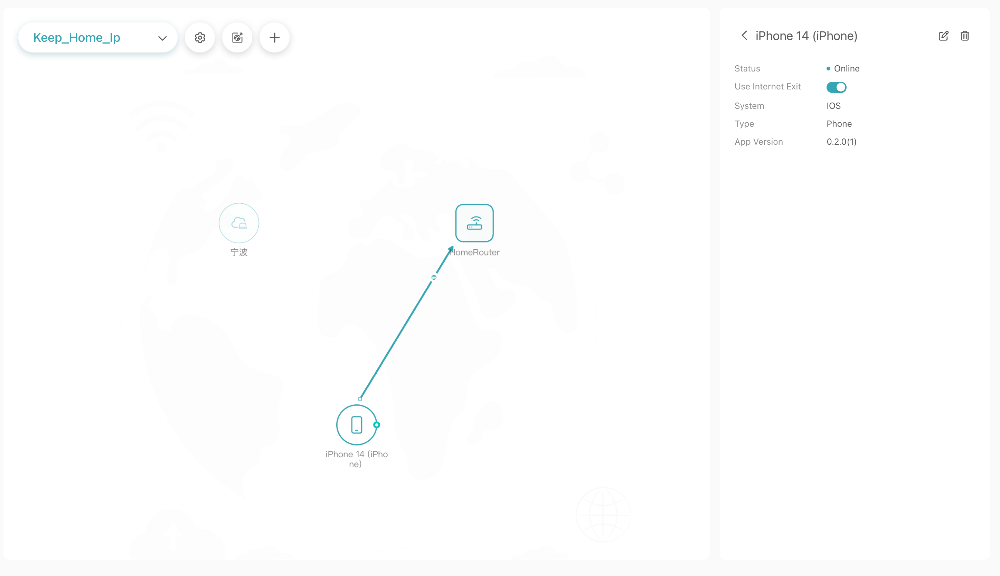
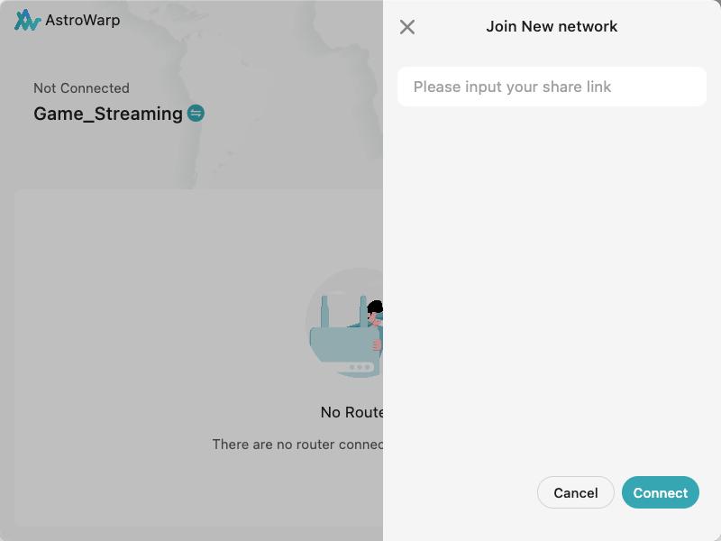
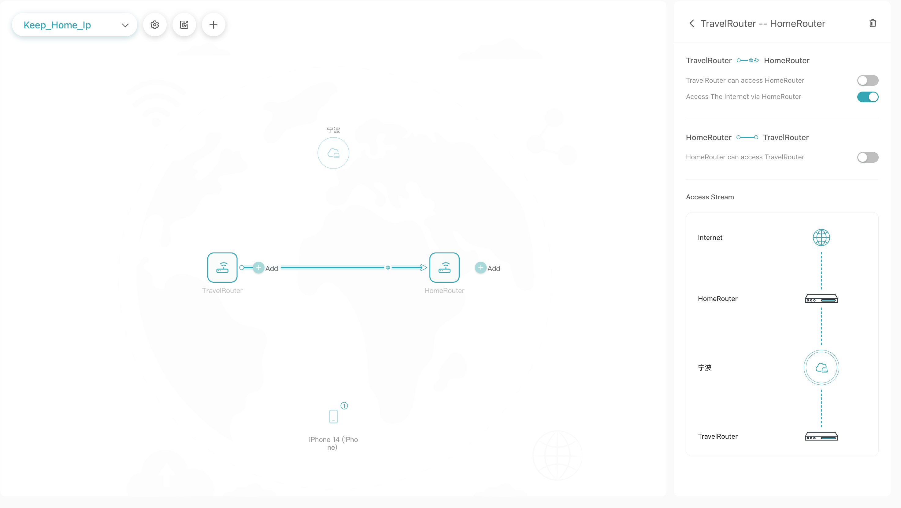
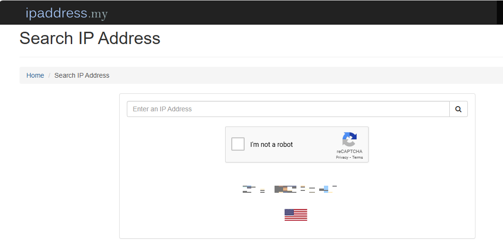

# Setting Up AstroWarp with GL.iNet Routers: Keep Your Home IP

This document outlines how to use your home network as an internet exit while traveling. By accessing the internet through your home network, you can ensure security and privacy while bypassing some traditional VPN limitations. For example, many services like Netflix restrict the use of VPNs in various situations. However, if you access the internet through your home network, you will not encounter these restrictions.

## **Creating the Network**

**Step 1:** Select a plan to create the network (available with Plus, Premium, and Elite plans).

**Step 2:** Set a Network Name: Choose a preferred name for your network, such as  Keep_Home_IP.

**Step 3:** Add the router located at your home to this network and complete the payment.

**Step 4:** Set the internet exit to the home router.

**Step 5:** Click the "+" icon in the top right corner of the interface to add your device as a client to the network. Configure the client to access the home router and use it as the internet exit.

Input the network's share link in the app, or add the travel router to the network and configure it to use the home router as its internet exit.

**Step 6:** Open a browser on the client device using the app or connected to the travel router, and visit [ipaddress.my](https://www.ipaddress.my/){target="_blank"} to check if the public IP address matches the IP address of your home network.

