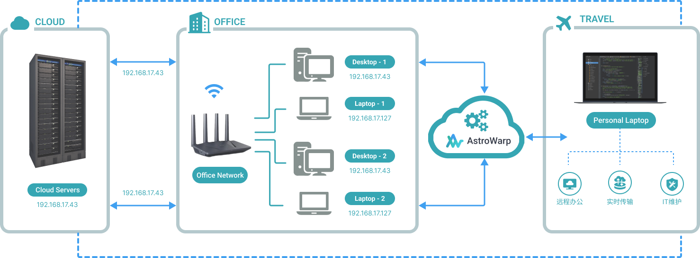
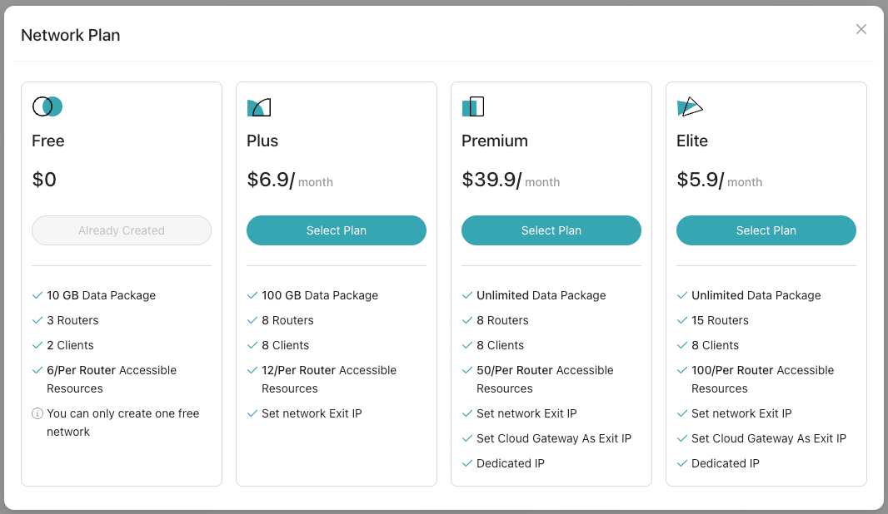
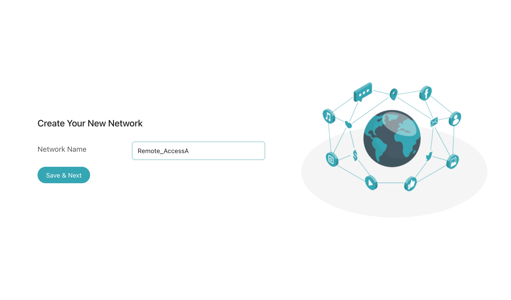
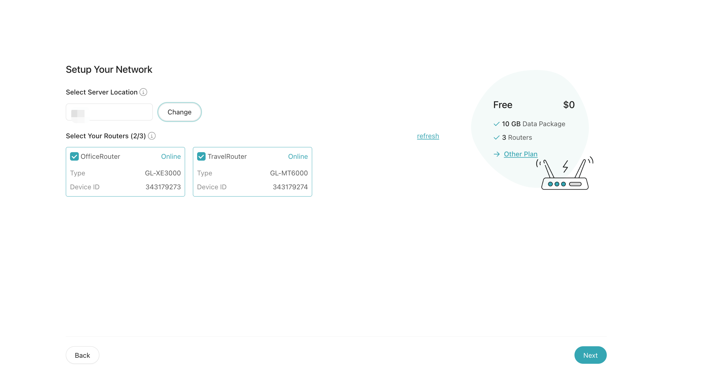
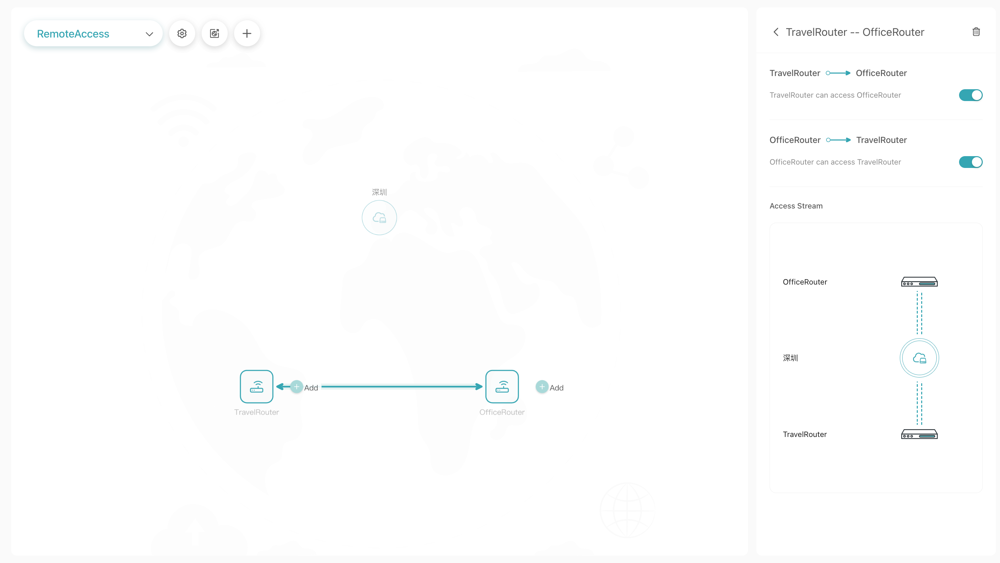
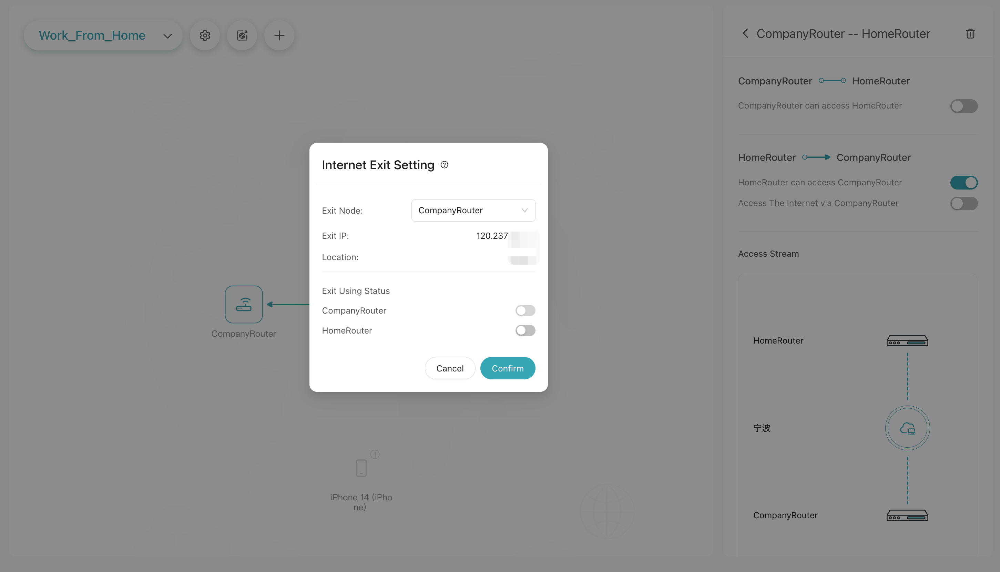

# Setting Up AstroWarp with GL.iNet Routers: Remote Access

This document outlines the steps to create a remote access scenario that allows you to securely access your company's network resources, such as computers, NAS, printers, etc, from a remote location.

## **Creating the Network**

**Step 1:** Select a plan to create the network (available with all plans).

**Step 2:** Set a Network Name: Choose a preferred name for your network, such as "Remote_Access".

**Step 3:** Add the router located at your company to this network.

**Step 4:** After creating the network, the routers added to the network will be associated by default, allowing them to communicate with each other. Please be aware that if you need to access the network resources linked to the router, you must click the "Add" button on the topology map to designate them as accessible resources. For security purposes, you can manage access permissions on the right-hand side of the interface and disable access from the company router to the travel router.

**Step 5:** Set the internet exit to the company router, and configure the travel router and devices to connect through it. This allows you to remotely access services like NAS or GitLab anytime using the company router's IP address.

The remote access network is now set up.

**Step 6:** Using this virtual IP address, you can perform a series of remote operations on your office computer from the home computer, such as using [Windows Remote Desktop Connection](https://support.microsoft.com/en-us/windows/how-to-use-remote-desktop-5fe128d5-8fb1-7a23-3b8a-41e636865e8c#ID0EDD=Windows_10){target="_blank"}.

<!--  -->

