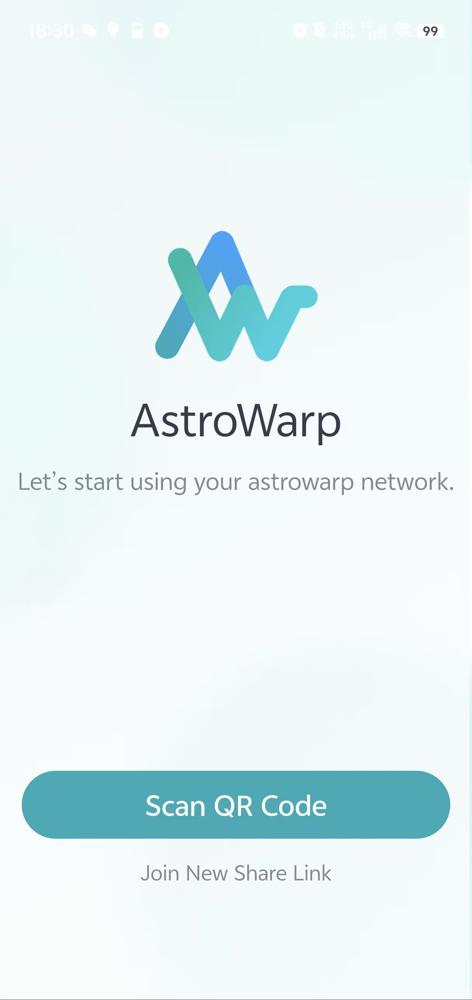

# Use the AstroWarp client

## **Preparation**

Before start, You should create your network as described in the [Quick Start](../quick_start/index.md) and download the appropriate client application [here](https://www.astrowarp.net/download).

## **Add share link in network**

**Step 1:** Add share link in Astrowarp network

**Step 2:** Set up share link

{class="glboxshadow"}

{class="glboxshadow"}

**Link Lifetime:**  The validity period of the shared link

**Add Once:**  Whether to allow the shared link to be used by multiple clients

**Use Internet Exit:**  Whether to allow the client to use the Internet exit

**Accessible Router: ** List of routers to be accessed

## **Join network in client**

Join the Astrowarp network using the shared link in the client

* windows

{class="glboxshadow"}

* Mobile phone

## **FAQ** 

**Q:** How can I quickly apply the modified configuration on the client?

**A:** Exit and reopen the client to automatically re-pull the latest configuration

---

Still have questions? Visit our [Community Forum](https://forum.gl-inet.com){target="_blank"}.
